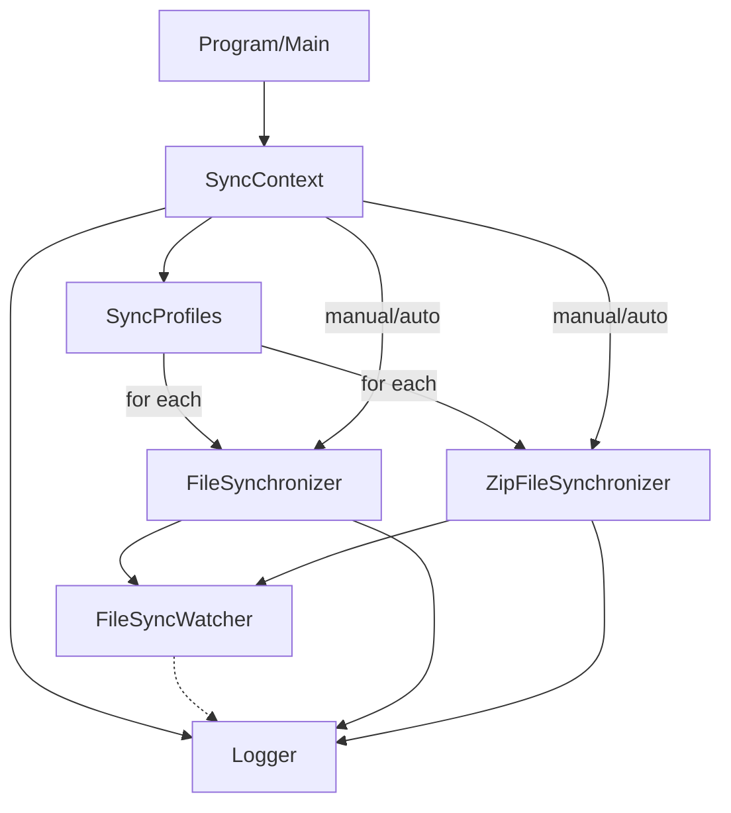

# SyncToyNext Architecture Overview

## Core Concepts

SyncToyNext is designed around a few key concepts that separate concerns and enable flexible, robust file synchronization:

### Profile
A **Profile** (represented by `SyncProfile`) defines a single synchronization job. It specifies the source directory, the destination (which can be a folder or a zip file), and options such as whether the destination is a zip, and the overwrite behavior. Profiles are the main units of configuration and allow users to define multiple independent sync jobs in a single configuration file.

### Synchronizer
A **Synchronizer** is a component responsible for performing the actual file synchronization between a source and a destination. It encapsulates the logic for copying files, handling overwrites, and ensuring the destination matches the source according to the configured rules. There are different synchronizer implementations for different destination types (e.g., folder or zip file), but all implement the same interface (`ISynchronizer`). Synchronizers do not monitor for changes themselves—they only execute sync operations when called.

### Watcher
A **Watcher** (specifically, `FileSyncWatcher`) is responsible for monitoring a source directory for changes (such as file creation or modification) in real time. When a change is detected, the watcher triggers the appropriate synchronizer to update the destination. The watcher does not contain sync logic itself; it delegates all sync actions to a synchronizer instance.

### Context
The **Context** (`SyncContext`) acts as the root coordinator for the application. It loads configuration, instantiates synchronizers and watchers for each profile, and manages their lifecycle. The context is responsible for starting and stopping watchers, handling manual sync requests, and ensuring that all components work together according to the user's configuration. It is the main entry point for both service and console modes.

### Logger
The **Logger** provides unified logging for all components. It records sync actions, errors, and status messages to both the console and a log file. Every synchronizer and watcher uses the logger for consistent reporting and troubleshooting.

---

## Core Components

### 1. ISynchronizer Interface
- **Role:** Defines a common contract for all synchronizer types.
- **Methods:**
  - `FullSynchronization(string sourcePath)`: Syncs all files and subdirectories from a source directory.
  - `SynchronizeFile(string srcFilePath, string relativeOrDestPath)`: Syncs a single file (to a directory or zip, depending on implementation).

### 2. FileSynchronizer
- **Implements:** `ISynchronizer`
- **Role:** Handles file/folder-to-folder synchronization (directory-to-directory).
- **Usage:**
  - Instantiated with a destination directory, overwrite option, and logger.
  - All methods are instance methods, using the provided logger for all actions and errors.

### 3. ZipFileSynchronizer
- **Implements:** `ISynchronizer`
- **Role:** Handles synchronization from a folder to a zip archive.
- **Usage:**
  - Instantiated with a destination zip file, overwrite option, and logger.
  - All methods are instance methods, using the provided logger for all actions and errors.

### 4. SyncContext
- **Role:** The root orchestrator of the application.
- **Responsibilities:**
  - Loads and parses the JSON configuration file (`SyncConfiguration`).
  - Instantiates and manages all sync profiles and their associated synchronizers.
  - Manages the lifecycle of file watchers (`FileSyncWatcher`) for real-time sync.
  - Handles manual sync triggers and graceful shutdown.
  - Integrates with the `Logger` for unified logging.
  - Uses only instance-based synchronizers, never static methods.

### 5. FileSyncWatcher
- **Role:** Monitors source directories for changes using .NET's `FileSystemWatcher`.
- **Responsibilities:**
  - Triggers synchronization automatically when changes are detected.
  - Handles errors and integrates with the logger.
  - Uses the correct synchronizer (as an `ISynchronizer` instance) for the profile's destination type.

### 6. Logger
- **Role:** Centralized logging utility.
- **Responsibilities:**
  - Logs all activity, errors, and status messages to both the console and a log file.
  - Used throughout all components for consistent reporting.

### 7. Command-Line Interface & Service Modes
- **CommandLineArguments:**
  - Parses and validates command-line arguments (e.g., config file path, service mode).
- **Program Entry Point:**
  - Determines whether to run as a console app, Windows service, or Linux/macOS daemon based on arguments and environment.
  - Instantiates `SyncContext` and manages application lifecycle.

### Command-Line/Service Coordination

- When running as a command-line tool on Windows, SyncToyNext will check if the SyncToyNext Windows service is running. If so, it will attempt to stop the service before starting the manual sync. If the service cannot be stopped, the application will exit to prevent conflicting sync actions. After the manual sync completes, the service will be restarted if it was running before.
- The `--recover` command line argument can be used to force a full sync on startup, simulating an unclean shutdown even if the previous shutdown was clean.
- The `--strict` flag enables strict file integrity checking (SHA-256 hash comparison) for all synchronizations.

## High-Level Flow

1. **Startup:**
   - The application starts via the console, as a service, or in a container.
   - Command-line arguments are parsed to determine config file and mode.
2. **Configuration Loading:**
   - `SyncContext` loads the JSON configuration and instantiates all `SyncProfile` objects.
3. **Synchronizer Instantiation:**
   - For each profile, the appropriate synchronizer (`FileSynchronizer` for directories, `ZipFileSynchronizer` for zip files) is created as an instance and its `FullSynchronization` method is called as needed.
4. **Watcher Setup:**
   - If enabled, `FileSyncWatcher` is started for each profile to monitor for changes, and uses the correct synchronizer for the destination type.
5. **Sync Operations:**
   - On startup, manual trigger, or file change, the synchronizer performs the sync operation according to the profile's settings.
6. **Logging:**
   - All actions, errors, and status updates are logged via the `Logger`.
7. **Shutdown:**
   - On user request or service stop, all watchers and sync operations are gracefully shut down.

## Extensibility
- The architecture is modular, making it easy to add new synchronizer types (e.g., cloud storage) or extend configuration options.
- Logging and error handling are centralized for maintainability.
- The use of the `ISynchronizer` interface enables polymorphic handling of different sync strategies.

## Diagram (Mermaid)

## Summary
SyncToyNext's architecture separates concerns between configuration, synchronization logic, real-time monitoring, and logging. The `ISynchronizer` interface enables robust, flexible, and cross-platform file synchronization for a variety of deployment scenarios, with all synchronizer logic now using instance-based methods and logger injection for consistency.
